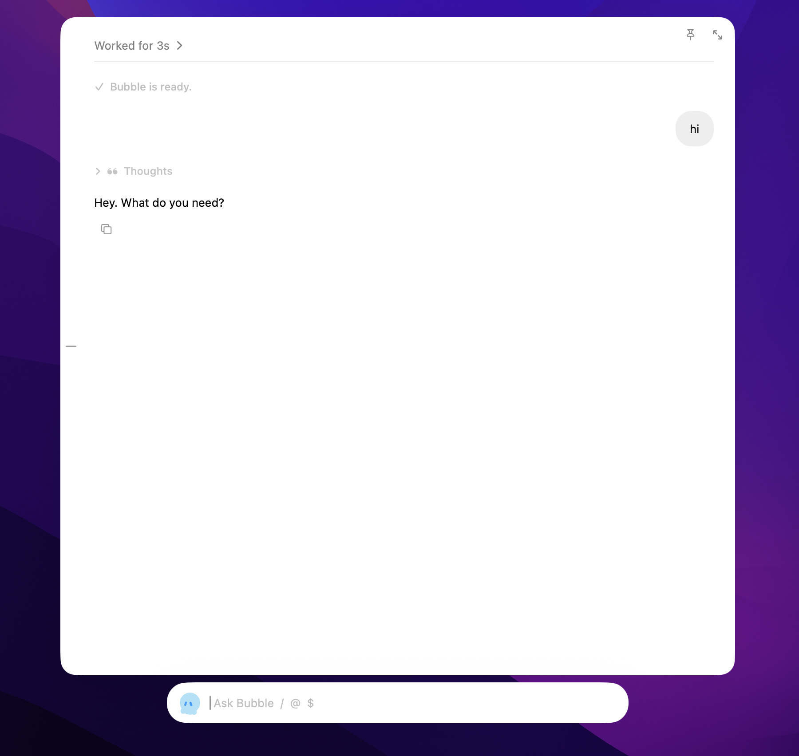

<p align="center">
  
</p>

<h1 align="center">Bubble</h1>

Bubble is a tiny macOS overlay around [Pi](https://pi.dev). Double-tap **Command** to open its floating input and conversation window, talk to the agent, and keep everything in **one session**.

The agent runs in `~/.bubble/workspace`. API keys still come from Pi (`~/.pi/agent/`). Bubble keeps its own `AGENTS.md` and model in `~/.bubble/`, so changing them does not change the Pi TUI.

<p align="center">
  
</p>

## Install

Bubble requires macOS 26 on Apple silicon and [Node.js 22.19+](https://nodejs.org/en/download).

1. Download the latest `Bubble-*-macOS-arm64.zip` from
   [Releases](https://github.com/KayakCbun/Bubble/releases).
2. Unzip it and move `Bubble.app` to `/Applications`.
3. Open Bubble and type `/setup`. That installs Pi and `pi-acp` into
   `~/.bubble/runtime` and reconnects.

Release builds are ad-hoc signed but not Apple-notarized. On first launch,
macOS may require **System Settings → Privacy & Security → Open Anyway**.

## Build from source

1. Install [Node.js 22.19+](https://nodejs.org/en/download). Bubble does not ship Node.

2. Build and launch:

   ```bash
   ./scripts/run.sh
   ```

3. Open Bubble and type `/setup`. That installs Pi and `pi-acp` into `~/.bubble/runtime` and reconnects. If Node is missing or too old, `/setup` opens the Node download page instead.

   Manual fallback, if you already use Pi from a terminal:

   ```bash
   curl -fsSL https://pi.dev/install.sh | sh
   npm install -g pi-acp
   ```

4. Sign in:

- Type `/login` and pick a provider, or
- `/login xai sk-...` to store an API key, or
- Menu bar → **Sign in with Pi…** (opens Terminal; in Pi type `/login`).

Then pick a model with `/model`. If Node, Pi, or a provider is missing, Bubble shows a setup card instead of failing silently. Type `/setup` from that card.

A menu-bar icon appears. There is no Dock icon.

## Use

- **Double-tap ⌘** to show or hide the panel (needs Accessibility for Bubble).
- Click the menu bar icon → **Toggle Overlay** if the hotkey is not granted yet.
- Type and press Enter.
- `/` opens Pi commands, prompt templates, and `/skill:name`.
- `/login` signs in a provider. `/resume` switches sessions. `/tree` lists this session’s user turns.
- `@` fuzzy-searches workspace files; `~/` and absolute paths also complete. `@clipboard` attaches the live clipboard (text, image, files).
- `/open` searches installed Mac apps and launches one.
- `$` picks a skill and inserts `/skill:name` so Pi loads it.
- `/mounts` searches folders under `~/` and toggles a mount. Mounted folders keep their own agent session; Bubble stays Bubble.
- Escape hides the panel, or cancels an in-flight turn. Clicking away also hides it.
- First run: menu bar → **Enable Double-tap ⌘…** and add `Bubble`.

Sessions persist in `~/.bubble/session-id`. Relaunches resume the same conversation through Pi.

## Composer

Bubble follows Pi’s editor triggers:

| Trigger | What |
| --- | --- |
| `/` | Slash commands, prompt templates, and `/skill:name` |
| `/setup` | Install Pi and `pi-acp` into `~/.bubble/runtime` (opens Node download if Node is missing) |
| `/login` | Sign in a provider (API key or Pi in Terminal) |
| `/resume` | Switch to a previous Bubble session |
| `/tree` | List this session’s user turns; `/tree 3` copies one into the composer |
| `/open` | Search and launch installed Mac apps |
| `/mounts` | Browse folders under `~/`. Click a row to open it; the status icon mounts or unmounts |
| `@` | File mention from `~/.bubble/workspace`, or `~/` / absolute paths |
| `@clipboard` | Attach the current clipboard |
| `$` | Skill picker (inserts `/skill:name `) |

`/help` lists commands and skills. Overlay-local: `/setup`, `/install`, `/login`, `/logout`, `/resume`, `/tree`, `/reload`, `/clear`, `/new`, `/copy`, `/quit`, `/model`, `/thinking`, `/agents`, `/open`, `/mounts`, `/clipboard`. `/skill` lists installed skills. Others such as `/compact` and `/skill:research` are sent to Pi.

Short phrases like `打开 Safari` or `open WeChat` also launch the matching app directly.

## Mac capabilities

Bubble is a real macOS app, so it can do things Pi’s bash session is weaker at:

| Action | How |
| --- | --- |
| Attach clipboard | `@clipboard`, `/clipboard`, the clipboard button, or menu **Attach Clipboard**. Text, images, and copied files. |
| Open an app | `/open` then type a name, or `打开 Safari`. |
| Mount a folder | `/mounts`, menu **Workspaces…**, or ask Bubble to mount a path. |

The agent can still use `pbpaste` and `open -a` during a turn. Credentials and file tools stay with Pi.

## Bubble-only settings

These stay in `~/.bubble/` and do not rewrite `~/.pi/agent/settings.json`.

| Setting | How |
| --- | --- |
| **AGENTS.md** | Menu bar → **Edit AGENTS.md**, or `/agents`. File: `~/.bubble/AGENTS.md` (linked into the workspace). |
| **Model** | Menu bar → **Model**, or `/model`. Saved in `~/.bubble/config.json`. |
| **Thinking** | Menu bar → **Thinking**, or `/thinking`. |

Until you pick a Bubble model, the current Pi session default is used. Credentials still live in Pi.

Skills are discovered from `~/.bubble/workspace/.pi/skills/`, `~/.pi/agent/skills/`, `~/.agents/skills/`, and project `.pi/skills` / `.agents/skills`. Asking Bubble to add a skill installs it under `~/.bubble/workspace/.pi/skills/` unless you say otherwise. Choosing a skill sends Pi’s `/skill:name` command so pi-acp expands it.

## Files

| Path | What |
| --- | --- |
| `~/.bubble/AGENTS.md` | Bubble-only agent instructions |
| `~/.bubble/workspace/.pi/skills/` | skills that belong to Bubble |
| `~/.bubble/config.json` | Bubble model and thinking |
| `~/.bubble/runtime` | Bubble-managed Pi and `pi-acp` (`/setup`) |
| `~/.bubble/workspace` | Pi working directory |
| `~/.bubble/mounts.json` | mounted folders and the active workspace brief |
| `~/.bubble/session-id` | the one conversation |
| `~/.bubble/transcript.json` | local UI history |
| `~/.bubble/overlay.log` | app log |
| `~/.pi/agent/` | Pi credentials, catalogs, TUI defaults |

## License

Bubble's original code and assets are available under the [MIT License](LICENSE).
The bundled Avatar engine remains AGPL-3.0-only, and the bundled Mermaid
renderer remains MIT-licensed. See [Third-party notices](THIRD_PARTY_NOTICES.md)
for provenance and the applicable license files.
